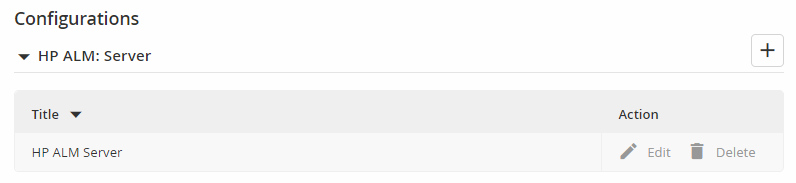
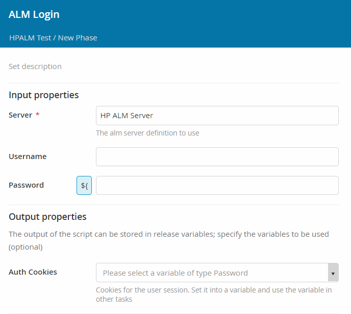
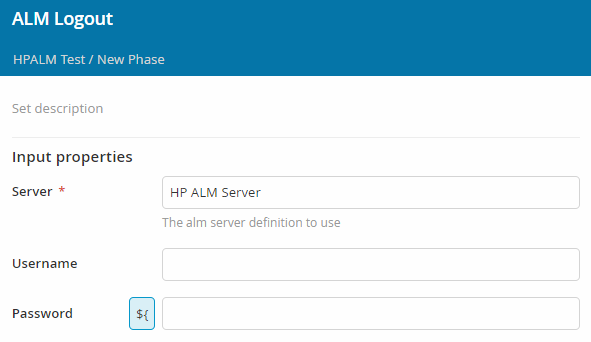
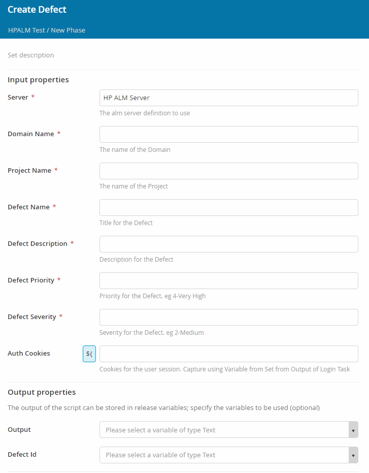
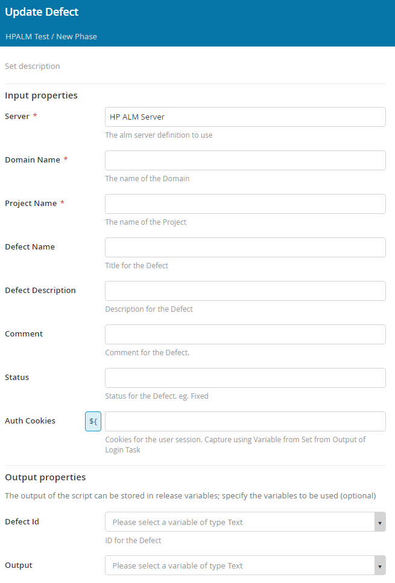
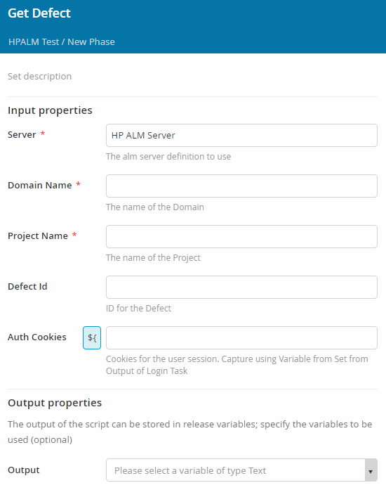
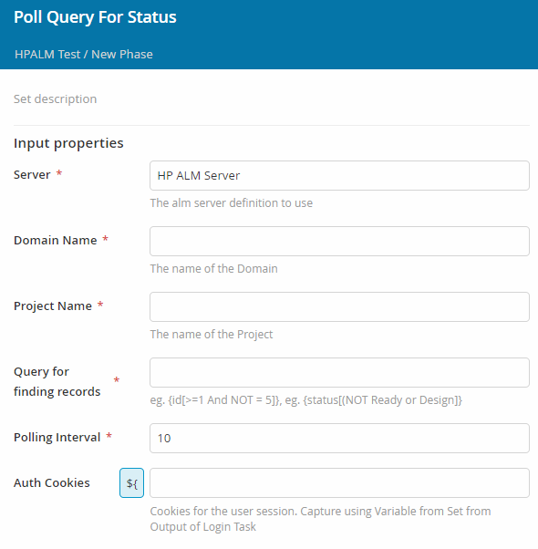

## Build Status

[![Build Status][xlr-hpalm-plugin-travis-image]][xlr-hpalm-plugin-travis-url]

[![License: MIT][xlr-hpalm-plugin-license-image]][xlr-hpalm-plugin-license-url]
[![Github All Releases][xlr-hpalm-plugin-downloads-image]]()
[![Code Climate][xlr-hpalm-plugin-code-climate-image]][xlr-hpalm-plugin-code-climate-url]

## Preface

This plugin offers an interface from XL Release to Hp/Microfocus ALM. 

## Building the plugin

`./gradlew clean build`

## Testing the plugin

Run the following command to run a local docker container with the plugin installed.  

`./gradlew runDockerCompose`

Per the configuration at `src/test/resources/docker/docker-compose.yml,` the ports are defined so you can browse the local instance at:

`http://localhost:35516` 

## Overview

### Features

#### Server Configuration

Add a sever configuration in the XL Release Shared Configuration page for each server or login you wish to manage.

Each entry has the following configuration items in its definition:

##### Basics
*   Title - the name by which you will be referring to this definition in your XLR tasks and dashboard tiles.
*   URL - The URL of the HP ALM server
*   Authentication Method - None, Basic, Ntlm, PAT

##### Authentication
*   Username
*   Password
*   Domain
*   Enable SSL Verification

##### Proxy
*   Proxy Host
*   Proxy Port
*   Proxy Username
*   Proxy Password

#### Login
Use this task to logon to a HP ALM server.

##### Input parameters
*   Server - as configured in XL Release
*   Username - Override the default configuration as needed
*   Password - Specify only if you are overriding the default username

##### Output Properties
*   Save the Authorization cookies to a variable for reuse in other tasks.

#### Logout
Use this task to log out of a HP ALM server.

##### Input parameters
*   Server - as configured in XL Release
*   Username - Override the default configuration as needed
*   Password - Specify only if you are overriding the default username

#### CreateDefect
Use this task to create a new defect in HP ALM

##### Input parameters
*   Server - as configured in XL Release
*   Domain Name
*   Project Name
*   Defect Name
*   Defect Description
*   Defect Priority
*   Defect Severity
*   Authorization Cookies

##### Output parameters
*   Output - Task output
*   Defect ID - The ID of the newly created defect

#### UpdateDefect
Update an existing Defect with new information

##### Input parameters
*   Server - as configured in XL Release
*   Domain Name
*   Project Name
*   Defect Name
*   Defect Description
*   Comment
*   Status
*   Authorization Cookies

##### Output Properties
*   Defect ID - The ID of the newly created defect
*   Output - Task output

#### GetDefect
Retrieve an already existing Defect

##### Input parameters
*   Server - as configured in XL Release
*   Domain Name
*   Project Name
*   Defect ID
*   Authorization Cookies

##### Output Properties
*   Output - Task output

#### DeleteDefect

Delete an existing Defect

##### Input parameters
*   Server - as configured in XL Release
*   Domain Name
*   Project Name
*   Defect ID
*   Authorization Cookies

##### Output Properties
*   Output - Task output

#### PollQueryForStatus

Poll the server for a change in the named defect

##### Input parameters
*   Server - as configured in XL Release
*   Domain Name
*   Project Name
*   Query for finding Records
*   Polling Interval - in seconds
*   Authorization Cookies

### Dashboard

#### QueryTile

[xlr-hpalm-plugin-travis-image]: https://travis-ci.org/xebialabs-community/xlr-hpalm-plugin.svg?branch=master
[xlr-hpalm-plugin-travis-url]: https://travis-ci.org/xebialabs-community/xlr-hpalm-plugin
[xlr-hpalm-plugin-code-climate-image]: https://codeclimate.com/github/xebialabs-community/xlr-hpalm-plugin/badges/gpa.svg
[xlr-hpalm-plugin-code-climate-url]: https://codeclimate.com/github/xebialabs-community/xlr-hpalm-plugin
[xlr-hpalm-plugin-license-image]: https://img.shields.io/badge/License-MIT-yellow.svg
[xlr-hpalm-plugin-license-url]: https://opensource.org/licenses/MIT
[xlr-hpalm-plugin-downloads-image]: https://img.shields.io/github/downloads/xebialabs-community/xlr-hpalm-plugin/total.svg
