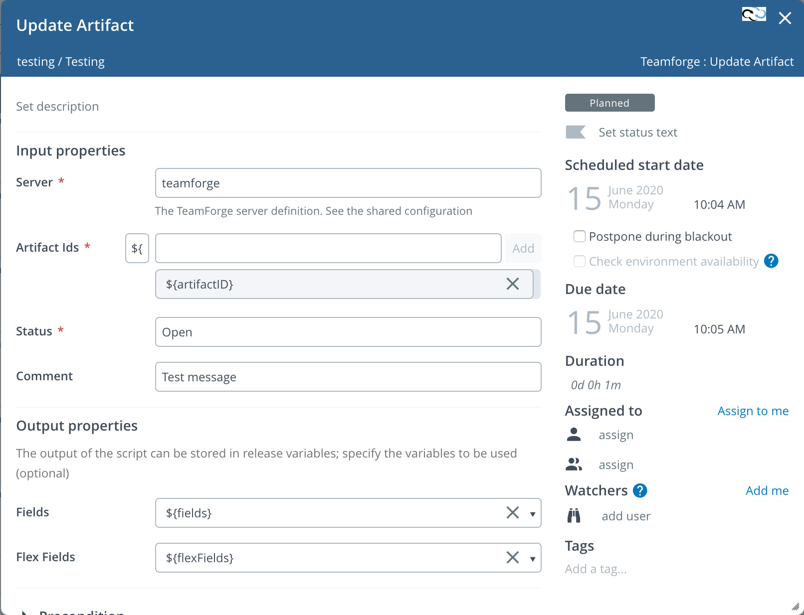

## Build Status

[![Build Status][xlr-teamforge-plugin-travis-image]][xlr-teamforge-plugin-travis-url]
[![Codacy Badge][xlr-teamforge-plugin-codacy-image]][xlr-teamforge-plugin-codacy-url]
[![Code Climate][xlr-teamforge-plugin-code-climate-image]][xlr-teamforge-plugin-code-climate-url]
[![License: MIT][xlr-teamforge-plugin-license-image]][xlr-teamforge-plugin-license-url]
![Github All Releases][xlr-teamforge-plugin-downloads-image]

[xlr-teamforge-plugin-travis-image]: https://api.travis-ci.org/xebialabs-community/xlr-teamforge-plugin.svg?branch=master
[xlr-teamforge-plugin-travis-url]: https://travis-ci.org/xebialabs-community/xlr-teamforge-plugin
[xlr-teamforge-plugin-codacy-image]: https://api.codacy.com/project/badge/Grade/99114736d2b9428f813bcd24f52e2a61
[xlr-teamforge-plugin-codacy-url]: https://www.codacy.com/app/zvercodebender/xlr-endevor-plugin?utm_source=github.com&amp;utm_medium=referral&amp;utm_content=xebialabs-community/xlr-endevor-plugin&amp;utm_campaign=Badge_Grade
[xlr-teamforge-plugin-code-climate-image]: https://codeclimate.com/github/xebialabs-community/xlr-teamforge-plugin/badges/gpa.svg
[xlr-teamforge-plugin-code-climate-url]: https://codeclimate.com/github/xebialabs-community/xlr-teamforge-plugin
[xlr-teamforge-plugin-license-image]: https://img.shields.io/badge/License-MIT-yellow.svg
[xlr-teamforge-plugin-license-url]: https://opensource.org/licenses/MIT
[xlr-teamforge-plugin-downloads-image]: https://img.shields.io/github/downloads/xebialabs-community/xlr-teamforge-plugin/total.svg

## Preface

This plugin offers an interface from XL Release to Teamforge.

## Building the plugin

`./gradlew clean build`

## Testing the plugin

Run the following command to run a local docker container with the plugin installed.  

`./gradlew runDockerCompose`

Per the configuration at `src/test/resources/docker/docker-compose.yml,` the ports are defined so you can browse the local instance at:

`http://localhost:15516`

## Overview

### Features

#### Server Configuration

Add a sever configuration in the XL Release Shared Configuration page for each server or login you wish to manage.

##### Basics
*   Title - the name by which you will be referring to this definition in your XLR tasks and dashboard tiles.
*   URL - The URL of the Teamforge
*   Authentication Method - None, Basic, Ntlm, PAT

##### Authentication
*   Username
*   Password
*   Domain
*   Enable SSL Verification

##### Proxy
*   Proxy Host
*   Proxy Port
*   Proxy Username
*   Proxy Password

#### GetArtifactDetails
Use this task to get artifact details from Teamforge

##### Input parameters
*   Server - as configured in XL Release
*   Artifact ID

##### Output parameters
*   Fields
*   Flex Fields

#### GetArtifactChildren

Get a list of the child artifacts

##### Input parameters
*   Server - as configured in XL Release
*   Artifact ID

##### Output Properties
*   Children Artifact IDs

#### GetAssociations

Get a list of artifacts assiocated with another artifact

##### Input parameters
*   Server - as configured in XL Release
*   Artifact ID

##### Output Properties
*   Fields

#### CreateAssociations

Associate a list of artifacts to another artifact

##### Input parameters
*   Server - as configured in XL Release
*   Artifact ID
*   Associated Artifact IDs

##### Output Properties
*   Output - Task output

#### UpdateArtifact

Associate a list of artifacts to another artifact

##### Input parameters
*   Server - as configured in XL Release
*   Artifact ID
*   Status
*   Comment

##### Output Properties
*   Fields
*   FlexFields

### Dashboard

#### QueryTile
